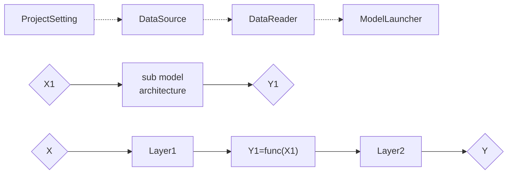

# Introduction to Image Classification
Image classification is a common deep learning task, whose inputs are images (`X`), and outputs are labels (classes, `Y`).

# OpenMindPlus for Image Classification
OpenMindPlus make it quite easy to build a image classifier by
+ `DataSource` to download and preprocess images<br/>
+ `KerasImageCategoricalFolderReader` to read images and generate `(X,Y)`<br/>
+ `Keras` layers to build model<br/>
+ Pretrained CNN networks<br/>
Below is a simplified diagram (dash line may be ignored)


## Data Source
The block `DataSource` let user easily download dataset from accessible sources. Now the sources can be set as
+ `http` or `https` urls
+ `hdfs` address
+ `Kaggle` competition name

`DataSource` will download the data according to their types, and un-archive (decompress) them if necessary. To fit the data format to the requirement of data reader, user can input lines of codes that will be executed as `Callback`. User can also use built-in functions such validation splitting in the `Callback`.

## Data Reader
The block `KerasImageCategoricalFolderReader` is the default data reader for image classification tasks. User can customize a data reader if they want [*To be added*]. This block wraps `Keras` method `flow_from_directory` [(see more)](https://keras.io/preprocessing/image/#flow_from_directory), so the image stored in disk must be compatible with its requirement. User can specify `train-folder`, `validation-folder` and `test-folder` on demand.

# Code genration
here is example of code generated (given the `model-id` is `mymodel`) (_please note that the code is example and the details may differ from practice_)<br/>
```python
def get_y1():
    submodel = ...
    return submodel

def get_y():
    input_ = Input(...)
    layer1_ = Layer1(...) (input_)
    y1_ = get_y1() (layer1_)
    output_ = Layer2(...) (y1_)
    return model([input_], [output_])

def data_source_callback(self):
    val_ratio = self.get('validation-split')
    train_validation_split_folder('your/data/folder', val_ratio)

with open('path/to/output/config.json') as fn:
    config = json.load(fn)

builder = generate_builder(config)
builder.generate_model([get_y])
builder.data_src.get_data(data_source_callback)
builder.data_reader.read_data()
result = builder.train()
```
